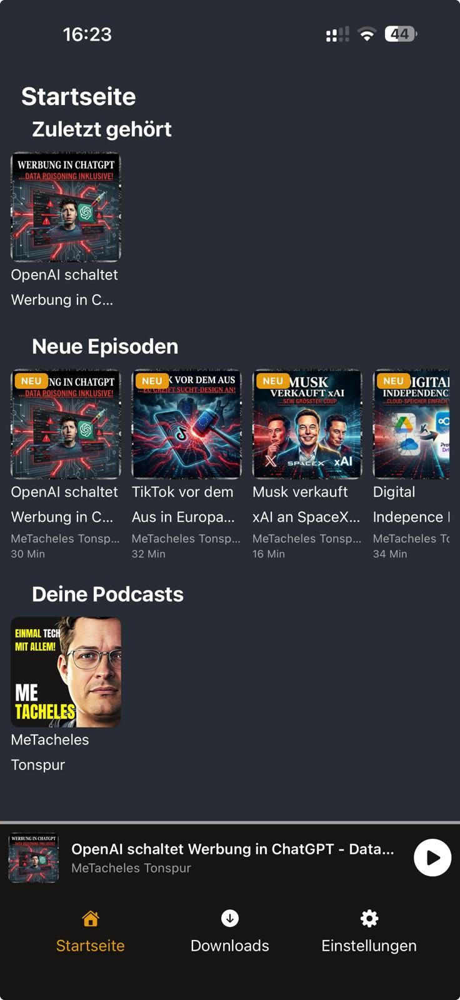
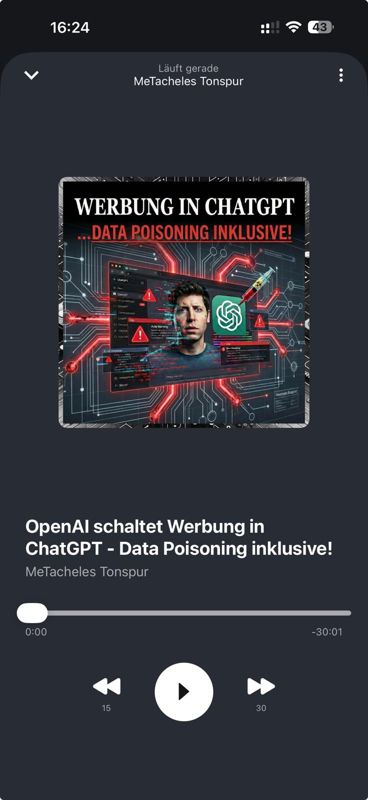

# Mobile app

Podfetch also has a mobile app for Android and iOS. For Android you can download it directly from Obtainium. There is no iOS version because Apple requires a paid developer account to publish apps on the App Store, and Podfetch is a free and open source project. However if someone is willing to pay the 100€ fee I can publish it also for iOS.

## Downloading and installing for Android

1. Go to the [Obtainium website](https://obtainium.imranr.dev/) and download the latest obtainium.apk file.
2. Open Obtainium and put the url https://github.com/SamTV12345/PodFetch into the search bar. After that click on Search and it will say podfetch.apk is available in version x.x.x. Click on install and wait for the installation to finish.
3. Open the app and enter the url of the PodFetch instance server you want to connect to. Depending on your auth settings you might also need to enter your username and password. After that click on Connect and you should be able to see your podcasts and episodes, and they sync via the standard PodFetch API.
4. You can also download episodes for offline listening. When you are back online the app will automatically sync your downloaded episodes with the server, so you can listen to them on other devices as well.

## Some impressions

[]

[]

[]

## Progressive Web App (PWA) on Android and iOS

You can also use the web UI as an installable PWA. This enables a standalone app-like experience and lock-screen media controls.

1. Open your Podfetch web UI in the mobile browser (`https://your-server/ui/`).
2. Android (Chrome/Edge): open browser menu and choose `Install app` / `Add to Home screen`.
3. iOS (Safari): open Share menu and choose `Add to Home Screen`.
4. Start playback once from the installed app. The media controls are then available from lock screen and notification controls.
