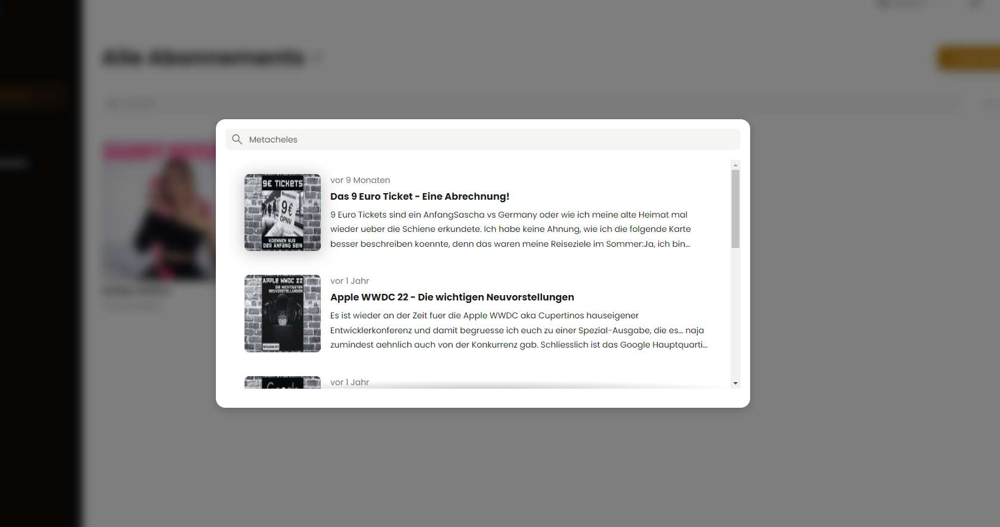
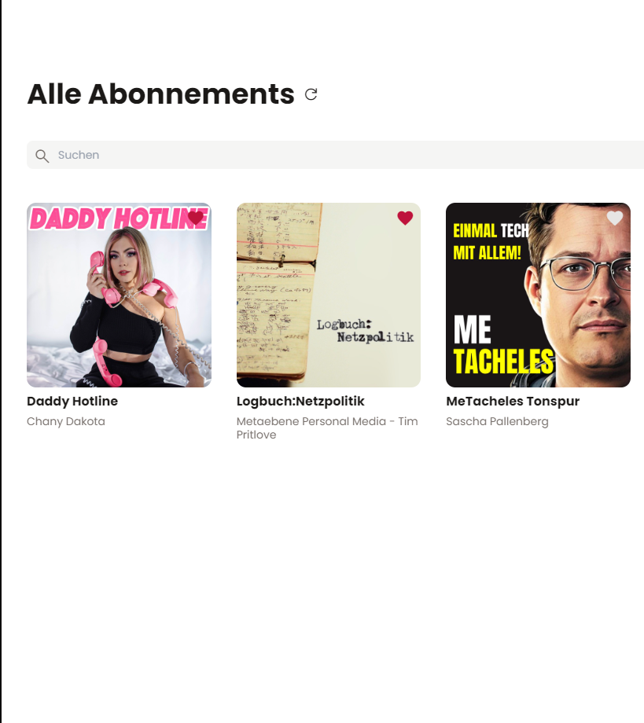
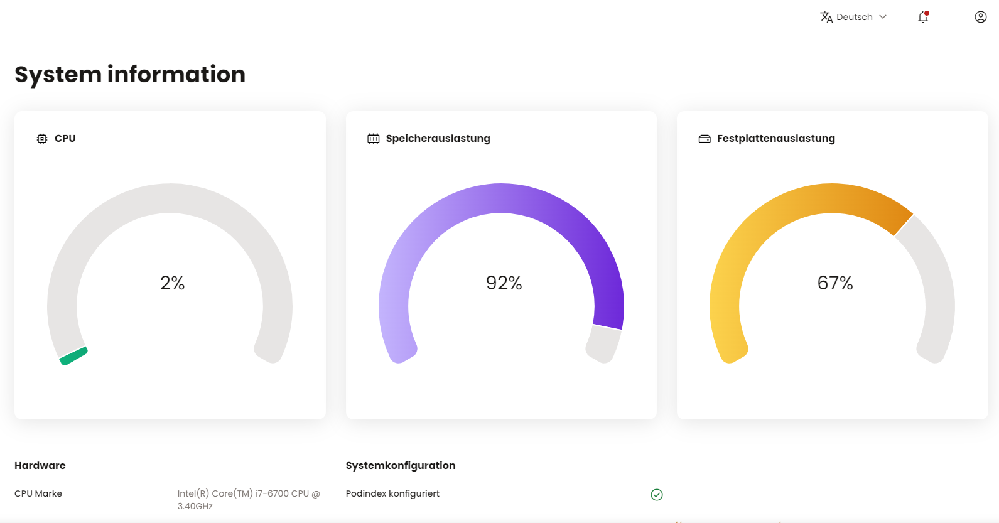
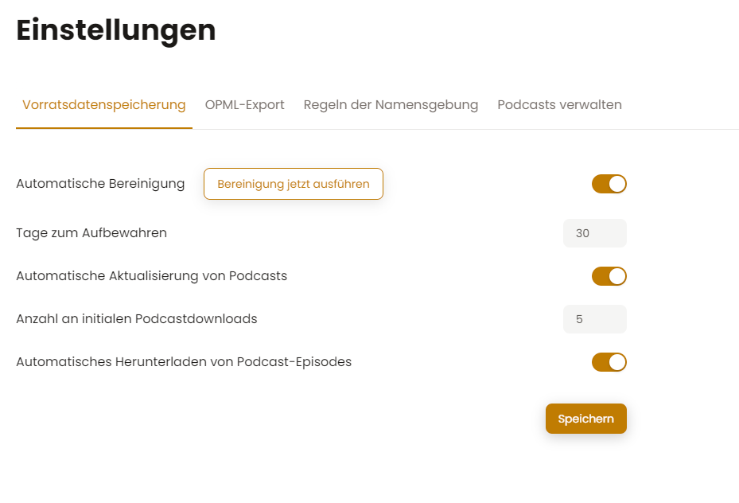
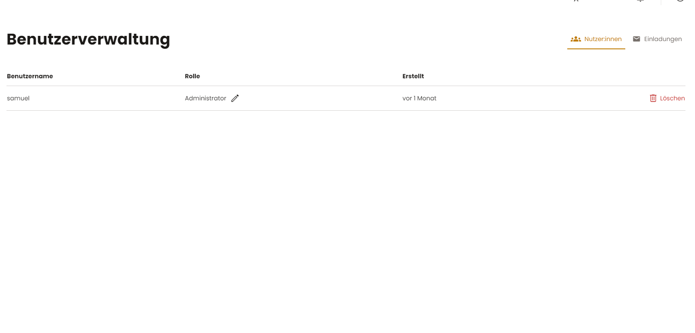

# UI

## Audio Player
The podcast listening tool contains an advanced audio player that can be used to listen to your podcasts,skip episodes, turn the volumes as high as 300% or skip around in the current episode.

# Continue right where you stopped

The tool will automatically save your progress in the current episode and will resume from where you left off even if you close the browser.
You can continue listening on all devices by just hitting play on any episode on your home screen.

## Search for podcasts
You can search for podcast episodes by hitting CTRL+F and typing any word that might appear in the description or title of the podcast episode you want to listen to.

Below are some fullscreen images so you can get a better grasp of the UI.

## Home Screen

## Timeline View

## Info View

## Settings

## Administration

