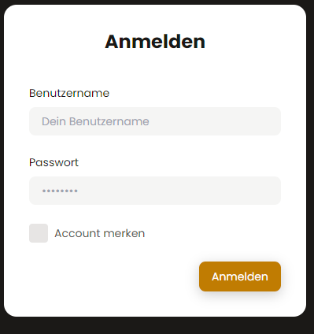
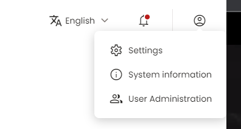

# Setting up Basic auth and user management


1. Set up the environment variables in your docker-compose under the PodFetch service:

```yaml
BASIC_AUTH: true
USERNAME: test
PASSWORD: test
```


2. Run `docker-compose up -d` to start the service.

Make sure to change the username and password to something more secure than `test` and `test`.

# UI Login

Enter your credentials from step 1. If you don't want to enter always username and password you can click on memorize account. This is not recommended if this computer is not yours/shared with others.




3. [Optional] Invite other users to your instance

Because listening to podcasts is kind of boring you can invite your family/friends to also use your podcast server to stream podcasts. Therefore go to User administration which is found in the top right corner when clicking on the user avatar icon.



Here you can view all the existing users:

You can edit their role by clicking on the pencil in the role column or delete them by clicking on the trash icon.
You can create a new invitation by selecting the "Invites" tab on the right hand, Click on +Add new. Here you can select the role of the user to invite and if he is allowed to listen to explicit podcasts. After that click on createInvite.
You can now see the invite in the table. It has an expiracy date of 1 week. So after 1 week the invite cannot be used again. You can click on the link icon to copy the invite link and paste it into e.g. Discord/WhatsApp or your messenger of choice.

On the other end the invitee can simply copy that link, paste it into his/her browser and take the registration steps. He/She can review the settings taken by the administrator and enter a username/password for the login page. The password needs to be strong. So it must have a length of 8, a number, a small letter and a capital letter.

E.g.:

- ✅ Test123$Test
- ✅ myComplicated$Password
- ❌ test
- ❌ weakPassword

Upon succesful registration you should see a success message with account created. Now the user should be redirected to /ui and can also login as the administrator has done it in the second step.

