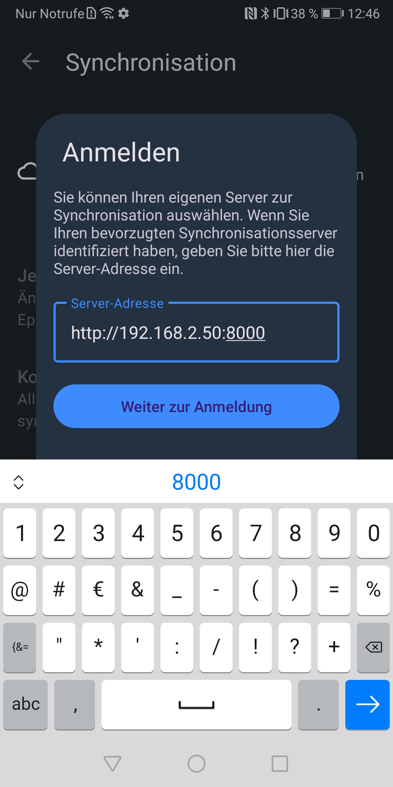
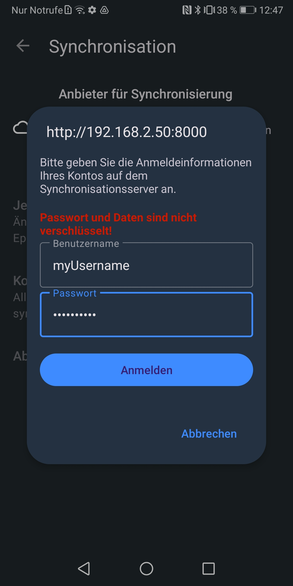
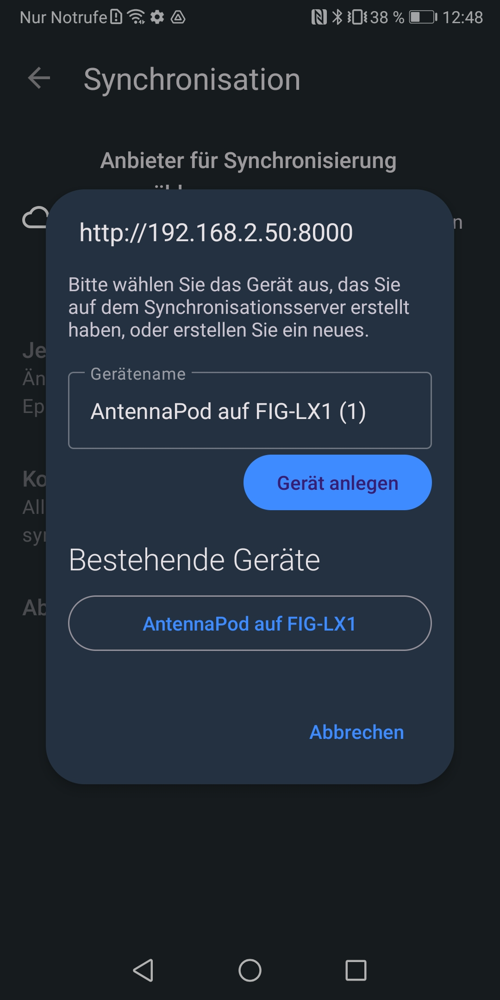
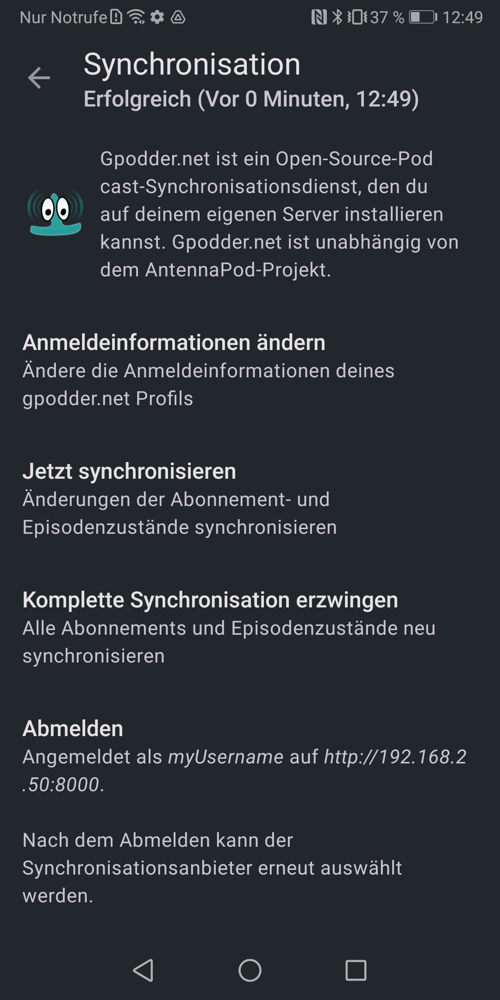

# GPodder API

## 📖 Activating the GPodder API

The following environment variable must be set to `true` to enable it:

| Variable                          | Description                                             | Default             |
|-----------------------------------|---------------------------------------------------------|---------------------|
| GPODDER_INTEGRATION_ENABLED       | Activates the GPodder integration via your `SERVER_URL` | false               |

## ⚙️ Using the GPodder API

For the GPodder API, you need to choose a way to authenticate yourself. You can use:
- Basic Auth
- OAuth2
- Proxy Auth

## 👤 Create a user via the CLI

For AntennaPod to succesfully authenticate it requires a username and password. In order to enable that we jump to the commandline. If you have PodFetch running in Docker just execute:

```bash
docker ps #This will help you obtain the container's id and name
docker exec -it <your-container-id> /app/podfetch users add
```

After that a dialog opens up. I paste here a sample you can change username and password etc. to the values you like.

```
Starting from command line
User management
Enter your username:
myUsername
User does not exist
Enter your password:

Select your role user, admin, uploader
user
Should a user with the following settings be applied User { id: 0, username: "myUsername", role: "user", password: Some("myPassword"), explicit_consent: false, created_at: 2023-07-22T10:39:59.297771400 }
Y[es]/N[o]
Yes
User succesfully created
```

After that you have created a user with the username myUsername and the password: myPassword. It is enough to have him assigned to the role user. You could e.g. switch to another admin user that adds new podcasts for increased security.


## 🖂 Create a user via the UI

You can also generate a user using the invite function within the GUI

To generate an invite, log into Podfetch → Top Right Icon → User Administration → Invites . This works on both basic auth and OIDC.

## 📱 Setting up AntennaPod

First download the app:

- Google: https://play.google.com/store/apps/details?id=de.danoeh.antennapod&hl=de&gl=US
- FDroid: https://f-droid.org/de/packages/de.danoeh.antennapod/ ⚠️ Be aware that the FDroid version doesn't have the 
  Google signing for usage in an Android car. So if you have an Android Car and want to navigate via the built-in touchscreen you definitely need the one from the Google App Store

After opening the app, press the burger menu and tap settings. Go to synchronisation => Select provider => GPodder.net



1. Enter here your SERVER_URL

⚠️ AntennaPod always chooses https and thus requires a valid SSL certificate from e.g. Let's Encrypt. If you want to host PodFetch in your local network it is okay to not use SSL. Therefore you can use http:// to establish an insecure connection which AntennaPod will complain in the next steps about.

2. Enter the username and password of the user that you created before through the CLI




3. Choose an existing device or create a new device

A user can have different devices or restore from existing device configuration. This is what the next view is about. You can choose between using an existing device. That is the ovale device below. This can be done by simply tapping on it.

If you don't see a device because you started the server from scratch you can name your device to a memorable one so you can later select the correct device better.



4. Success screen

You should now see this screen. Tap on Sync now and the modal should close leaving you at the synchronisation page.



5. Test the settings
You can test the settings by tapping on Sync now. After a short period the title on the navbar should change to Success #currentTimestamp

6. Import the respective podcast into podcast Because not everybody can download/create a podcast it is necessary to 
also download a podcast to the server. Therefore go to the homepage and add the podcast. If the rss feeds are the same they are linked in the backend and you can listen to the podcasts from your phone or via the web and the two locations synchronize with each other.


